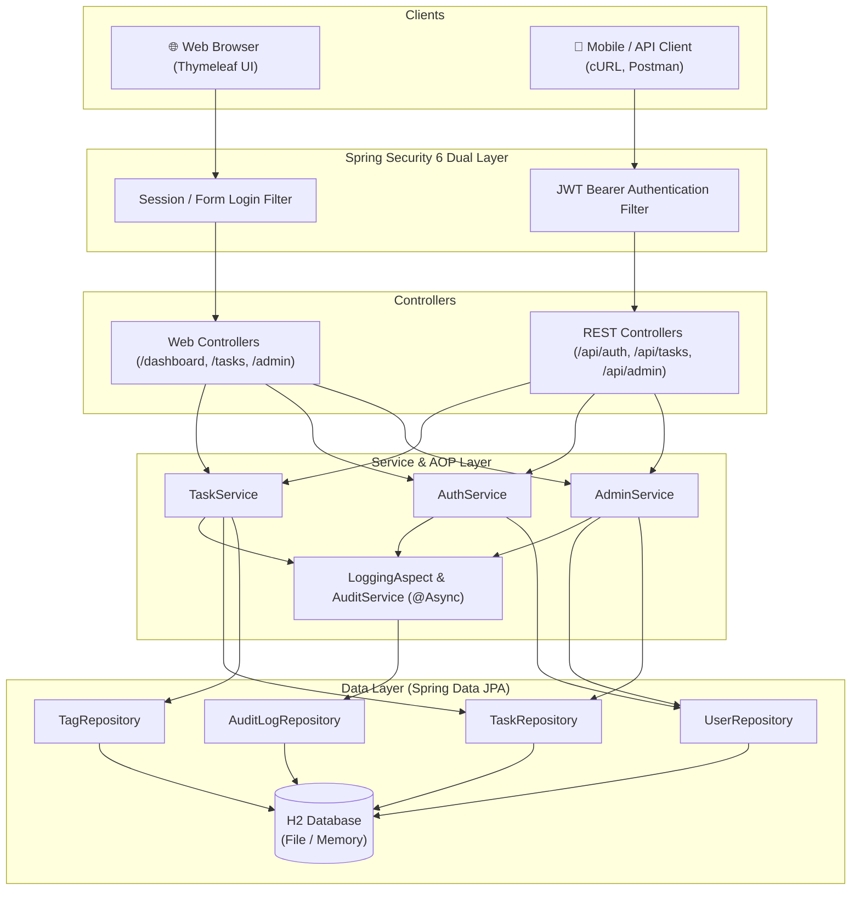

# 🚀 TaskNova — Enterprise Task Management System

[](https://openjdk.org/projects/jdk/17/)
[](https://spring.io/projects/spring-boot)
[](https://spring.io/projects/spring-security)
[](https://github.com/jwtk/jjwt)
[](https://www.thymeleaf.org/)
[](https://www.docker.com/)
[](https://render.com/)
[](https://opensource.org/licenses/MIT)

> **TaskNova** is a modern, enterprise-ready task management platform built with **Spring Boot 3.3.5**, featuring a dual-layer security model (interactive Thymeleaf server-side UI + stateless REST API with JWT), asynchronous AOP audit logging, role-based access control (RBAC), and cloud deployment readiness with Docker and Render.

---

## 📌 Table of Contents

- [Overview](#-overview)
- [Key Features](#-key-features)
- [Architecture & Tech Stack](#-architecture--tech-stack)
- [System Architecture Flow](#-system-architecture-flow)
- [Default Seed Credentials](#-default-seed-credentials)
- [Quick Start Guide](#-quick-start-guide)
  - [Prerequisites](#prerequisites)
  - [Local Installation](#local-installation)
- [Interactive API Documentation (Swagger UI)](#-interactive-api-documentation-swagger-ui)
- [REST API Endpoints](#-rest-api-endpoints)
- [Database & Schema](#-database--schema)
- [Docker & Containerization](#-docker--containerization)
- [Cloud Deployment (Render)](#-cloud-deployment-render)
- [Configuration & Environment Variables](#-configuration--environment-variables)
- [Project Directory Structure](#-project-directory-structure)
- [Contributing & License](#-contributing--license)

---

## 🌟 Overview

TaskNova bridges the gap between traditional full-stack web applications and modern headless microservices:
1. **Interactive Web Portal**: A sleek, dark-mode-first server-rendered interface powered by **Thymeleaf 3**, custom CSS design tokens, glassmorphism UI components, and client-side JavaScript.
2. **Stateless RESTful API**: Complete REST API endpoints secured via **JWT (JSON Web Tokens)** for mobile apps, SPAs, and third-party integrations.
3. **Enterprise Governance**: Automated auditing through **Spring AOP** logging user actions and task status transitions asynchronously into an append-only audit trail.

---

## ✨ Key Features

### 🔐 Dual-Layer Security & RBAC
- **Hybrid Security Architecture**:
  - **Session-based Form Login**: Seamless UX for web portal navigation with CSRF protection.
  - **Stateless Bearer JWT Authentication**: HMAC-SHA256 tokens for all `/api/**` REST endpoints.
- **Role-Based Access Control**:
  - `ROLE_USER`: Manage personal tasks, view metrics, assign tags, track progress.
  - `ROLE_ADMIN`: Global oversight of all tasks, system analytics, user management, and audit log inspection.
- **Secure Password Storage**: BCrypt hashing with configurable work factor.

### 📋 Full-Cycle Task Management
- **Status Workflow**: `TODO` ➔ `IN_PROGRESS` ➔ `REVIEW` ➔ `DONE` with real-time transition validation.
- **Priority Matrix**: `LOW`, `MEDIUM`, `HIGH`, and `URGENT` with visually distinct urgency badges.
- **Deadlines & Overdue Detection**: Automated overdue flags based on target completion dates.
- **Dynamic Tagging System**: Reusable tags (`Bug`, `Feature`, `DevOps`, `UI/UX`, etc.) for multifaceted categorization.
- **Search, Filtering & Pagination**: Filter tasks by title, status, priority, tag, or assignee with pagination support.

### 👥 Dedicated User & Admin Portals
- **User Dashboard (`/dashboard`)**:
  - Quick KPI overview (Total, In Progress, Completed, Overdue).
  - Recent task activity list and priority distribution breakdown.
- **Task Workspace (`/tasks`)**:
  - Task search, filter tabs, modal task creator, edit forms, and detailed task viewer.
- **Admin Control Center (`/admin/dashboard`)**:
  - System-wide statistics and task distribution metrics.
  - **User Management (`/admin/users`)**: Activate/deactivate accounts and change user roles.
  - **All-Tasks View (`/admin/tasks`)**: Administrative oversight across all organizational tasks.
  - **Audit Logs (`/admin/audit-logs`)**: Real-time trail of who changed what, when, and from where.

### ⚡ Asynchronous AOP Auditing
- Non-blocking auditing powered by **Spring AOP** (`@Aspect`) and `@Async` thread pools.
- Automatically captures:
  - Task creation, modification, status transition, and deletion.
  - User status changes (activation / suspension).
  - Client IP addresses, usernames, action types, and entity metadata.

### 🩺 Production Observability
- **Spring Boot Actuator**: Health check endpoint (`/actuator/health`), application metadata (`/actuator/info`), and runtime metrics.
- Health check integrated into multi-stage Docker build and cloud orchestration.

---

## 🛠 Architecture & Tech Stack

| Layer | Technology | Details |
| :--- | :--- | :--- |
| **Backend Framework** | Spring Boot 3.3.5 | Java 17 LTS, Spring MVC, Spring Data JPA |
| **Security** | Spring Security 6 + JJWT 0.12.6 | Dual session/JWT authentication, BCrypt |
| **Database** | H2 Database | Persistent file mode locally, in-memory for cloud container |
| **ORM / Persistence** | Hibernate 6 / JPA | Auto-DDL update, Auditing, Entity Relationships |
| **Front-End View** | Thymeleaf 3 + Spring Security Dialect | Server-side templating with modular layouts |
| **Styling & UI** | Vanilla CSS3 (Custom Design System) | Modern dark theme, glassmorphism, responsive grid |
| **API Documentation** | Springdoc OpenAPI 2.6.0 | Swagger UI 3 with interactive live testing |
| **Aspects & Logging** | Spring AOP + SLF4J / Logback | Non-intrusive logging & async audit collection |
| **DevOps & Containers** | Docker + Render Blueprint | Multi-stage Docker build with non-root user security |

---

## 📐 System Architecture Flow



---

## 🔑 Default Seed Credentials

When TaskNova boots up, `DataSeeder` automatically populates default accounts (idempotently):

| Role | Username | Email Address | Default Password | Accessible Portals |
| :--- | :--- | :--- | :--- | :--- |
| **Administrator** | `admin` | `admin@tasknova.com` | `Admin@1234` | Full Admin Center (`/admin/**`), User Portal (`/tasks`, `/dashboard`), Swagger UI |
| **Standard User** | `demo_user` | `demo@tasknova.com` | `Demo@1234` | User Portal (`/tasks`, `/dashboard`), Task REST APIs |

> 💡 *Custom users can also be registered at `/auth/register` or via `POST /api/auth/register`.*

---

## 🚀 Quick Start Guide

### Prerequisites
- **Java JDK 17** or higher installed ([Download OpenJDK 17](https://adoptium.net/))
- **Git**
- *(Optional)* **Docker** if running containerized

### Local Installation

1. **Clone the Repository:**
   ```bash
   git clone https://github.com/MalayShikharSoni/TaskNova.git
   cd TaskNova
   ```

2. **Build and Run the Application:**
   - **Windows (PowerShell / CMD):**
     ```powershell
     .\mvnw.cmd spring-boot:run
     ```
   - **macOS / Linux:**
     ```bash
     chmod +x mvnw
     ./mvnw spring-boot:run
     ```

3. **Access the Application:**
   - **Web UI:** [http://localhost:8080](http://localhost:8080)
   - **Login Page:** [http://localhost:8080/auth/login](http://localhost:8080/auth/login)
   - **Swagger UI:** [http://localhost:8080/swagger-ui.html](http://localhost:8080/swagger-ui.html)
   - **H2 Console:** [http://localhost:8080/h2-console](http://localhost:8080/h2-console)
     - *JDBC URL:* `jdbc:h2:file:./data/tasknova`
     - *Username:* `sa`
     - *Password:* *(empty)*
   - **Actuator Health:** [http://localhost:8080/actuator/health](http://localhost:8080/actuator/health)

---

## 📖 Interactive API Documentation (Swagger UI)

TaskNova integrates **Springdoc OpenAPI 3**. You can interactively test every REST endpoint directly in your browser:

- **Swagger UI Endpoint:** `http://localhost:8080/swagger-ui.html`
- **OpenAPI JSON Spec:** `http://localhost:8080/v3/api-docs`

To authenticate in Swagger UI:
1. Send a `POST /api/auth/login` with your credentials.
2. Copy the returned `accessToken`.
3. Click the green **Authorize** button at the top of Swagger UI and enter `Bearer <your_token>`.

---

## 📡 REST API Endpoints

### Authentication (`/api/auth`)
| Method | Endpoint | Description | Access |
| :--- | :--- | :--- | :--- |
| `POST` | `/api/auth/register` | Register a new user account | Public |
| `POST` | `/api/auth/login` | Authenticate and obtain JWT token | Public |

#### Example: Login Request
```bash
curl -X POST http://localhost:8080/api/auth/login \
  -H "Content-Type: application/json" \
  -d '{
    "usernameOrEmail": "demo@tasknova.com",
    "password": "Demo@1234"
  }'
```

#### Response:
```json
{
  "accessToken": "eyJhbGciOiJIUzI1NiJ9...",
  "tokenType": "Bearer",
  "userId": 2,
  "username": "demo_user",
  "email": "demo@tasknova.com",
  "role": "ROLE_USER"
}
```

---

### Task Management (`/api/tasks`)
| Method | Endpoint | Description | Access |
| :--- | :--- | :--- | :--- |
| `GET` | `/api/tasks` | Get paginated tasks with search & filters (`status`, `priority`, `search`) | Authenticated |
| `GET` | `/api/tasks/{id}` | Get task details by ID | Authenticated |
| `POST` | `/api/tasks` | Create a new task | Authenticated |
| `PUT` | `/api/tasks/{id}` | Update an existing task | Authenticated |
| `PATCH` | `/api/tasks/{id}/status` | Quick status transition (`TODO`, `IN_PROGRESS`, etc.) | Authenticated |
| `DELETE` | `/api/tasks/{id}` | Delete a task | Owner / Admin |

---

### Admin Operations (`/api/admin`)
| Method | Endpoint | Description | Access |
| :--- | :--- | :--- | :--- |
| `GET` | `/api/admin/stats` | System KPI summary and counts | `ROLE_ADMIN` |
| `GET` | `/api/admin/users` | List all registered users | `ROLE_ADMIN` |
| `PATCH` | `/api/admin/users/{id}/status` | Toggle user active / suspended state | `ROLE_ADMIN` |
| `GET` | `/api/admin/audit-logs` | Retrieve paginated system audit trails | `ROLE_ADMIN` |

---

## 🗄 Database & Schema

TaskNova uses an optimized relational schema:
- **`users`**: User identity, credentials, roles (`ADMIN`, `USER`), status.
- **`tasks`**: Task records, descriptions, priority, status, due date, owner FK, assignee FK.
- **`tags`**: Reusable labels (`Bug`, `Feature`, `Documentation`, etc.).
- **`task_tags`**: Many-to-many junction table associating tasks with tags.
- **`audit_logs`**: Append-only log recording actor, action, target entity, timestamp, and IP address.

---

## 🐳 Docker & Containerization

TaskNova provides a secure, optimized **multi-stage Dockerfile**:
- **Stage 1 (Builder):** Uses Eclipse Temurin JDK 17 to compile and package the fat JAR.
- **Stage 2 (Runner):** Uses minimal Eclipse Temurin JRE 17 Alpine Linux.
- **Security:** Runs as an unprivileged non-root system user (`spring:spring`).

### Build & Run with Docker:

```bash
# 1. Build the Docker image
docker build -t tasknova:latest .

# 2. Run container on port 8080
docker run -d -p 8080:8080 --name tasknova-app tasknova:latest

# 3. View logs
docker logs -f tasknova-app
```

---

## ☁️ Cloud Deployment (Render)

TaskNova is configured for native deployment to **[Render](https://render.com/)** using the included [`render.yaml`](./render.yaml) Infrastructure-as-Code Blueprint.

### Deploying via Render Blueprint:
1. Fork or push this repository to your GitHub account.
2. Sign in to [Render Dashboard](https://dashboard.render.com/).
3. Click **New +** ➔ **Blueprint**.
4. Connect your `TaskNova` repository.
5. Render detects [`render.yaml`](./render.yaml) and creates the web service automatically on the **Free Tier**.
6. The service starts, performs health checks via `/actuator/health`, and provides you with a public URL!

---

## ⚙️ Configuration & Environment Variables

All settings can be customized via environment variables or in `src/main/resources/application.properties`:

| Variable | Default Value | Description |
| :--- | :--- | :--- |
| `SERVER_PORT` | `8080` | Port on which the application listens |
| `SPRING_DATASOURCE_URL` | `jdbc:h2:file:./data/tasknova;...` | H2 JDBC Connection URL |
| `SPRING_DATASOURCE_USERNAME` | `sa` | Database username |
| `SPRING_DATASOURCE_PASSWORD` | *(empty)* | Database password |
| `JWT_SECRET` | *(Auto-generated default)* | 256-bit secret key for HMAC signing |
| `JWT_EXPIRATION_MS` | `86400000` (24 hours) | JWT token lifespan in milliseconds |
| `SPRING_H2_CONSOLE_ENABLED` | `true` | Enable `/h2-console` (set `false` in prod) |
| `LOGGING_LEVEL_COM_TASKNOVA` | `DEBUG` (`INFO` on Render) | Root package logging verbosity |

---

## 📁 Project Directory Structure

```text
TaskNova/
├── .mvn/wrapper/                  # Maven wrapper binaries & properties
├── Dockerfile                     # Multi-stage Docker production build
├── render.yaml                    # Render Blueprint IaC configuration
├── pom.xml                        # Maven dependencies & build plugins
├── mvnw.cmd                       # Maven wrapper Windows script
├── src/
│   ├── main/
│   │   ├── java/com/tasknova/
│   │   │   ├── TasknovaApplication.java      # Application entrypoint (@EnableAsync)
│   │   │   ├── aop/                          # AOP Logging & Audit Interceptors
│   │   │   ├── config/                       # Security, JWT, JPA Auditing configs
│   │   │   ├── controller/
│   │   │   │   ├── AdminController.java      # Thymeleaf Admin portal controller
│   │   │   │   ├── AuthController.java       # Thymeleaf Auth page controller
│   │   │   │   ├── DashboardController.java  # Thymeleaf User dashboard controller
│   │   │   │   ├── TaskController.java       # Thymeleaf Task view controller
│   │   │   │   └── api/                      # REST API Controllers (Auth, Task, Admin)
│   │   │   ├── dto/                          # Request / Response DTOs
│   │   │   ├── entity/                       # JPA Entities (User, Task, Tag, AuditLog)
│   │   │   ├── exception/                    # Global Exception Handler & Custom Errors
│   │   │   ├── repository/                   # Spring Data JPA Repositories
│   │   │   ├── security/                     # UserDetailsService & JWT Filters
│   │   │   ├── seed/                         # DataSeeder (idempotent demo users & tasks)
│   │   │   └── service/                      # Core business services & interfaces
│   │   └── resources/
│   │       ├── application.properties        # Application configurations
│   │       ├── static/                       # CSS design system & JavaScript assets
│   │       └── templates/                    # Thymeleaf HTML views (User, Admin, Auth)
│   └── test/                                 # Unit & Integration tests
└── README.md
```

---

## 🤝 Contributing & License

Contributions, issues, and feature requests are welcome! Feel free to check the [issues page](https://github.com/MalayShikharSoni/TaskNova/issues).

Distributed under the **MIT License**. See `LICENSE` for more information.

---

<p align="center">
  Crafted with ❤️ by <a href="https://github.com/MalayShikharSoni">Malay Shikhar Soni</a>
</p>
